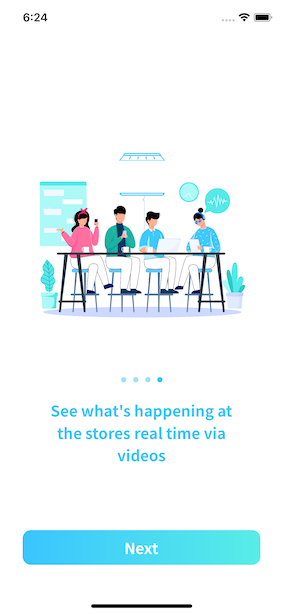

# **Joo Sung Kim**
# *June 4th 2020*
# **Sprint 1**

In the first sprint, I mostly focused on the learning curve of my own.  
I took the rein in developing the introduction splash/ onboarding page of `HITIT` user app.  
It was my first actual independent part of the project.  
Most of the onboarding view came about by using the `UICollectionView`, allowing for more components to be used as one part of the page.

### Screen shot:
 

 

## Components of the `UICollectionView`
 
Each page is loaded on to a cell with all components configuring each page.
 

### `UICollectionViewCell`

`UICollectionViewCell` allows for scrolling in whatever size we want.  
I wanted to have a few components that will correspondingly change as user goes from one page to another.
1. Configuring an animation for each feature to be emphasized
2. A section that indicates which page the user is previewing
3. A text field that will display corresponding messages to the animation
4. A button that will only be loaded and viewed in the last page for moving onto the sign up page.

Each UI component will be added by a `UIKit` component.  
Let me lay out what was used.
1. `Lottie` is an animation framework that **Airbnb** developed.  
After a json file just gets stored as an asset, same as the storage system of an image file, the custom framework will provide an animation to be controlled as desired.
2. The `PageControl` object of UIKit will allow for paging enabled views to be controlled.
3. `UILabel` will allow for a short form of text to be viewed, which does not need scrolling feature enabled.  
In that case, `UITextView` will suffice for services like ***Terms And Conditions***.
4. `UIButton` enables for actionable objects. In this case, linking another view or controller, an object, is handled by a button and targeted action.
 

## Testing
As our team is developing in a **TDD**, a 'test driven development', we need to write extensive and full covering tests for all code.  
Our ***sonarqube***, an automated code checking system, requires that 90% of code be covered by tests.  
If not, our continous integration system ***bamboo*** by ***Atlassian*** will not allow for deployment or even merging onto our master branch.
